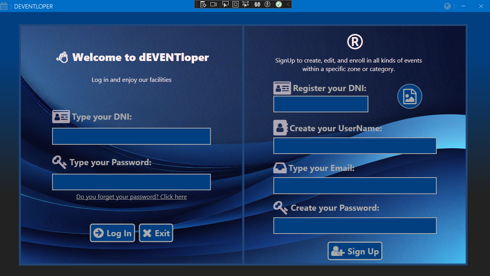
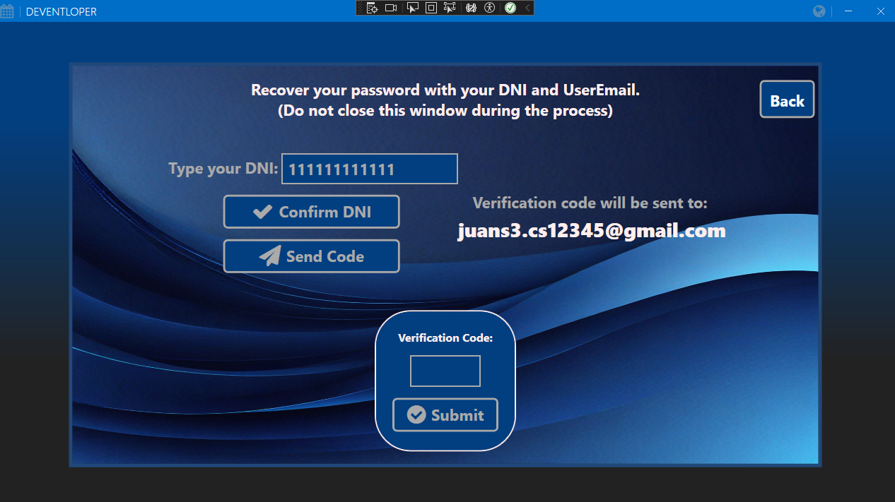
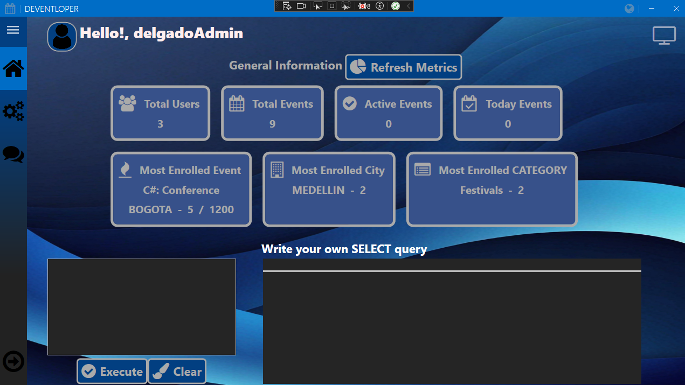
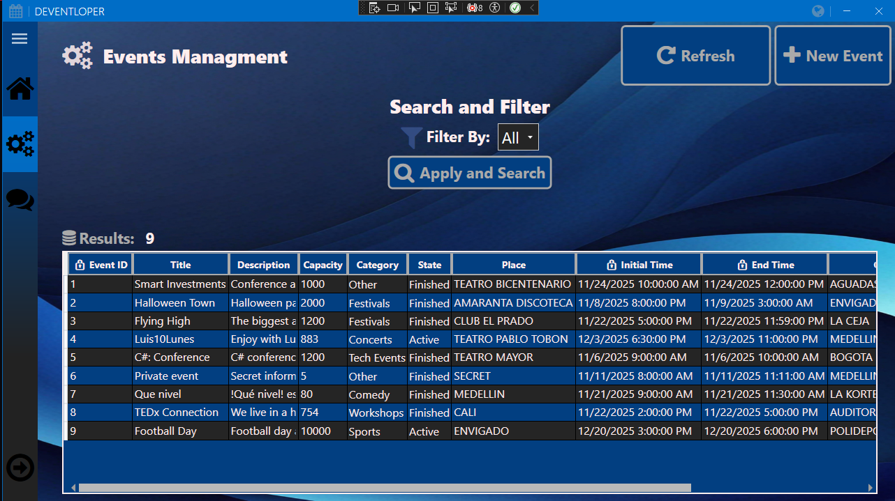
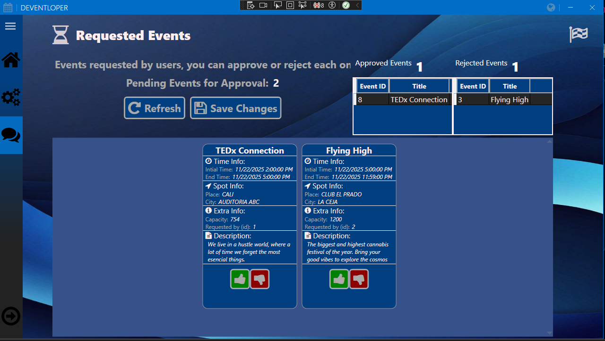
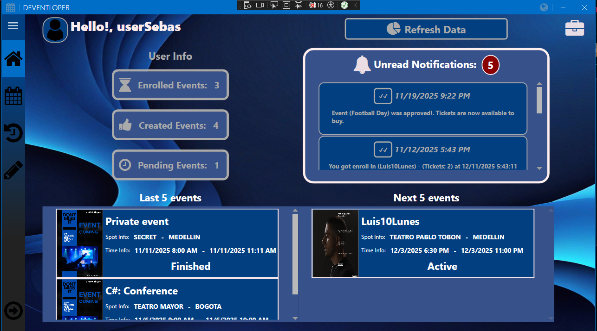
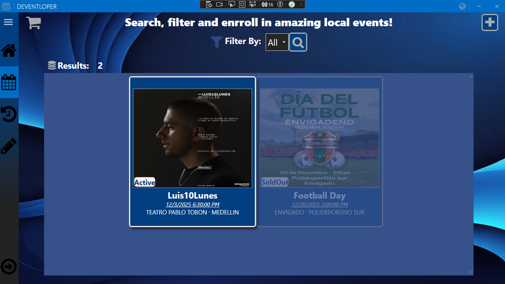
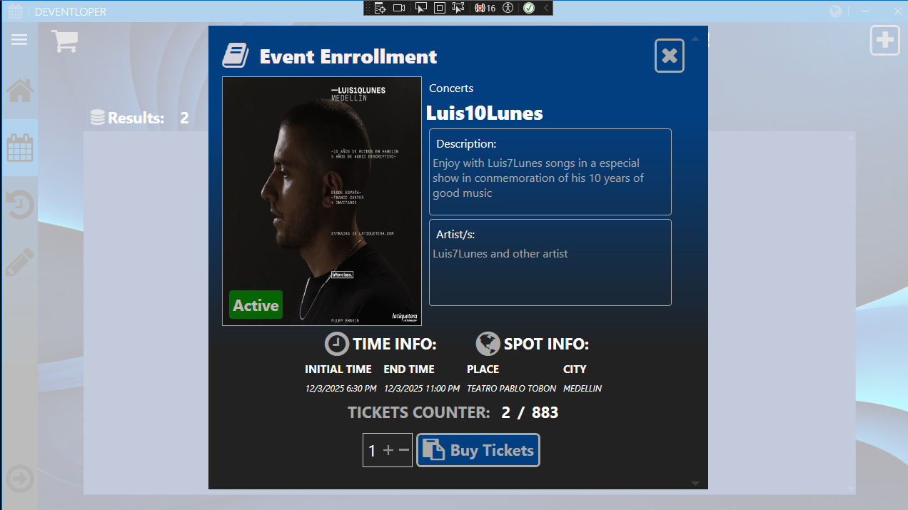
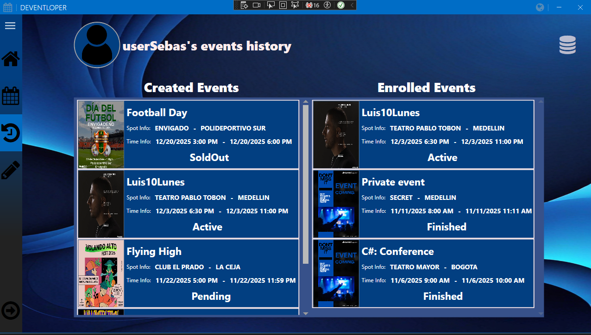
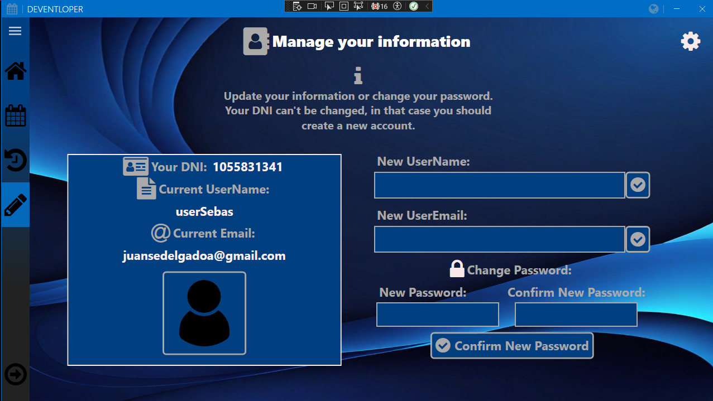

# 🎫 EventsProject — C# / WPF

EventsProject es una aplicación de escritorio para Windows desarrollada en C# utilizando WPF, orientada a la gestión e inscripción de eventos.
El proyecto funciona con una base de datos SQL Server en entorno local e implementa una arquitectura limpia que separa responsabilidades en las capas:

- DOMAIN
- APPLICATION
- INFRASTRUCTURE
- PRESENTATION

Además, se emplean patrones de diseño como Repository, Builder, y el uso de DTOs con sus respectivos mappers para la capa de presentación.

---

## 🚀 Funcionalidades principales
# 👤 Usuarios

- Registro de nuevos usuarios.
- Cambio de contraseña mediante verificación por correo electrónico.
- Visualización de información personal (Eventos creados, Eventos inscritos, etc.)
- Inscripción a eventos disponibles.
- Solicitud de creación de nuevos eventos (requiere aprobación del Administrador).
- Historial de eventos inscritos y creados.
- Actualización de datos personales (imagen, nombre, email).

# 🛠️ Administrador

- Visualización de estadísticas generales de la aplicación (usuarios totales, eventos totales, evento con más inscripciones, etc.).
- Consulta directa a la base de datos (solo consultas SELECT permitidas).
- Gestión completa de todos los eventos.
- Aprobación o rechazo de solicitudes de eventos hechas por los usuarios.

# ⚙️ General

- Encriptación segura de contraseñas.
- Validación de datos y formatos en los diferentes formularios.
- Sistema interno de notificaciones con su propio componente reutilizable.
- Componentes reutilizables para hacer mas atractivo visualmente y mejorar la interaccion con las diferentes entidades (Eventos).

---

## 📦 Librerías y paquetes utilizados

El proyecto utiliza diversas librerías de terceros para mejorar la seguridad, la interfaz de usuario, la comunicación con la base de datos y la experiencia general de uso:

# 🔐 Seguridad

- BCrypt.Net-Next: Utilizado para la encriptación y verificación de contraseñas mediante hashing seguro.
Garantiza que las contraseñas nunca se almacenen en texto plano.

# 🎨 Interfaz de usuario

- MahApps.Metro: Framework que moderniza la apariencia de aplicaciones WPF con estilos y controles tipo “Metro UI”.
Usado para diálogos, estilos y controles visualmente consistentes.
- FontAwesome.WPF: Permite integrar íconos vectoriales de Font Awesome directamente en controles WPF.
Útil para botones, menús y elementos visuales sin necesidad de imágenes externas.
- ToastNotifications: Librería para mostrar notificaciones flotantes dentro de la aplicación.
Se utiliza para feedback inmediato: éxito, error, advertencias, etc.

# ✉️ Comunicación

- MailKit: Utilizada para el envío de correos electrónicos para la recuperación/cambio de contraseña.

# 🗄️ Base de datos y configuración

- Microsoft.EntityFrameworkCore.SqlServer: Proveedor SQL Server para trabajar con EF Core en la capa Infrastructure/Application y el mappeo de la Base de Datos.
- Microsoft.Extensions.Configuration.Json: Manejo de archivos JSON de configuración (por ejemplo: appsettings.json).
- Microsoft.Extensions.DependencyInjection: Utilizado para implementar Inyección de Dependencias de forma nativa, siguiendo la arquitectura limpia.

---

## 🛠️ Instalación y configuración

### 1. Clonar o descargar el repositorio
Clona el proyecto con: git clone https://github.com/JSebas-11/EventsProject.git; O descárgalo directamente desde GitHub.

### 2. Ejecutar en SQL Server el script DBDesign.sql
Este script crea toda la estructura de la base de datos necesaria para que la aplicación funcione (tablas, relaciones, restricciones, etc.).
Ejecuta el archivo en tu instancia de SQL Server usando SQL Server Management Studio o tu cliente preferido.

### 3. Configurar el archivo appsettings.json
Antes de ejecutar la aplicación, debes completar tres secciones clave del archivo appsettings.json.

#### 🔌 3.1 Cadena de conexión (DefaultConnection)
Agrega tu conexión con SQL Server a DefaultConnection:
- "Server={Tu conexion de servidor},{TCP/IP port};Database=BankProject;Trusted_Connection=True;TrustServerCertificate=True"

#### ✉️ 3.2 Configuración del SMTP (Envío de correos)
Completa la sección SMTPConfig con tu correo y la clave de aplicación de Gmail (App Password).
- 🔑 Cómo obtener la App Password en Gmail:
Abre tu Cuenta de Google -> Ve a Seguridad -> Activa Verificación en dos pasos si no está habilitada -> En la misma sección, entra a Contraseñas de aplicaciones
-> Crea una nueva contraseña para “Correo” o una app personalizada -> Copia el código generado (16 caracteres) y pégalo en "SMTPConfig:Password".
  
#### 👤 3.3 Datos del administrador por defecto
Se usa para crear un usuario administrador si no existe en la base de datos, (puedes dejar el default o cambiar los datos). Importante agregarle algun correo.

---

## 🖼️ Previsualizaciones

---
# Common Pages

---
# Admin Pages

---
# User Pages

